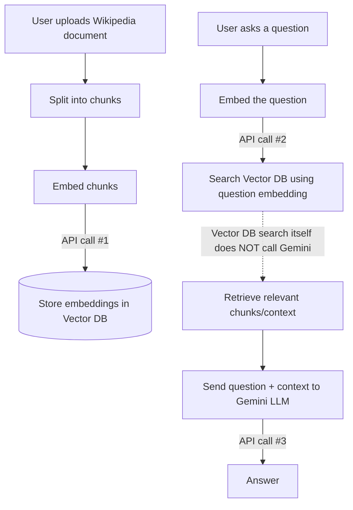

# AI Knowledge Inbox

AI Knowledge Inbox is a full-stack Retrieval-Augmented Generation (RAG) application. It allows you to ingest Wikipedia articles (or raw text), store them in a vector database, and ask questions about the ingested knowledge using Google's Gemini LLM.

## Architecture

The following diagram illustrates the flow of data through the RAG pipeline:



## Setup Instructions

### 1. Configure the API Key
This project is powered entirely by Google's Gemini Models for both text embeddings (`gemini-embedding-1.0`) and chat generation (`gemini-1.5-flash`). 

You will need a **Gemini Developer API Key**. You can get one for free from Google AI Studio (https://aistudio.google.com/).

### 2. Create the `.env` file
You must provide your API key to the backend via an environment variable.

1. Navigate to the `backend` folder.
2. Create a file named `.env`.
3. Add your Gemini API key to the file in the following format:

```env
GEMINI_API_KEY=your_gemini_api_key_here
```
*(Note: There is an `.env.example` file in the backend folder that you can copy and rename to `.env`)*

### 3. How to Run
The entire application (Frontend, Backend, and ChromaDB) is fully containerized using Docker.

1. Ensure you have Docker and Docker Compose installed and running on your system.
2. Open a terminal in the root of the project (where the `docker-compose.yml` file is located).
3. Run the following command to build and start the application:

```bash
docker-compose up --build
```

4. Once the containers are running:
   - The **Frontend UI** will be accessible at: `http://localhost:5173`
   - The **Backend API Docs** will be accessible at: `http://localhost:8000/docs`

## Usage
- Enter a Wikipedia URL (e.g., `https://en.wikipedia.org/wiki/Virat_Kohli`) in the sidebar and click **Ingest**.
- The backend will scrape the page, chunk it, embed it, and store it in the local SQLite/ChromaDB volumes.
- Use the main chat interface to ask questions about the ingested content!
