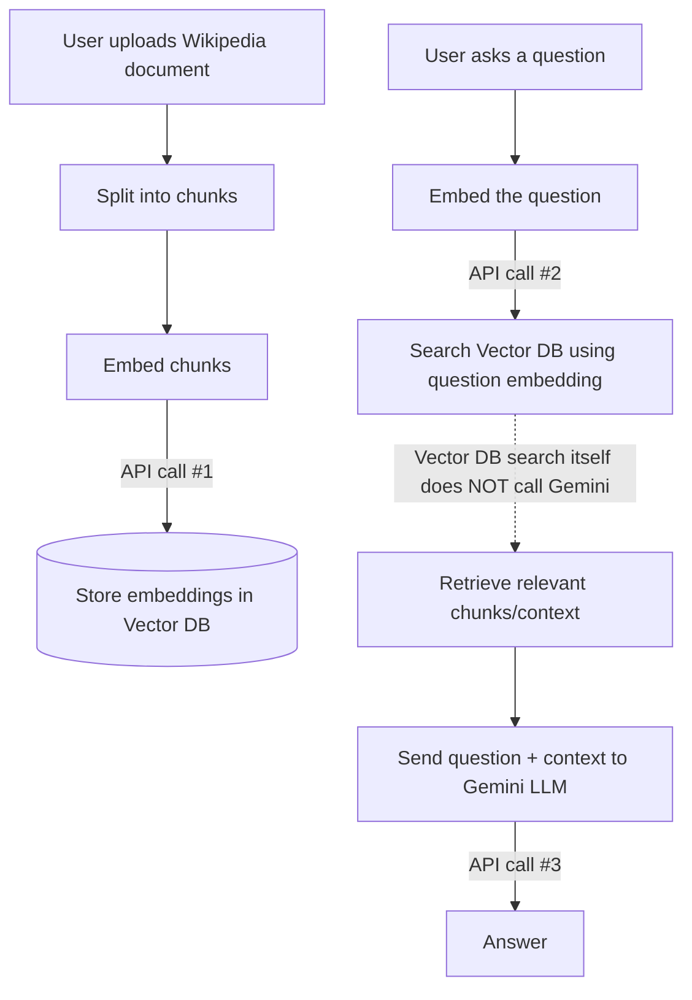

# AI Knowledge Inbox
Hey! This is a simple RAG (Retrieval-Augmented Generation) app that lets you feed Wikipedia articles into a local database and chat with them using Google's Gemini.

## How it works under the hood

Here's a quick look at what happens when you use the app:



## Getting started

To run this locally, you'll need a free Gemini Developer API key from Google AI Studio. 

### 1. Set up your API key
We need to pass your API key to the backend. 
- Go into the `backend` folder
- Create a new file called `.env`
- Paste your key in there like this:
```env
GEMINI_API_KEY=your_key_goes_here
```

### 2. Boot it up
Make sure you have Docker installed, then just run this in your terminal from the root folder:

```bash
docker-compose up --build
```

### 3. Try it out
Once Docker finishes building and starts the containers:
1. Open up the frontend at `http://localhost:5173`
2. Paste a Wikipedia link (like `https://en.wikipedia.org/wiki/Rohit_Sharma`) and hit Ingest.
3. Start asking questions!

*(If you want to poke at the raw API, the backend docs are at `http://localhost:8000/docs`)*
